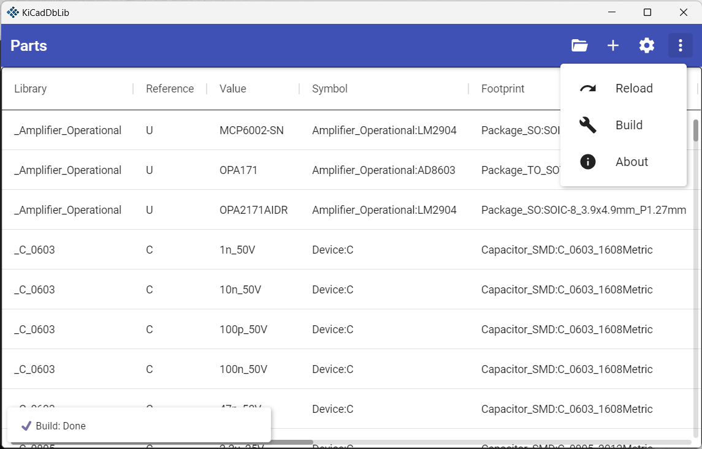

# KiCad-Db-Lib

- [KiCad-Db-Lib](#kicad-db-lib)
  - [About](#about)
  - [Usage](#usage)
    - [Settings](#settings)
      - [Paths](#paths)
      - [Fields:](#fields)
    - [Add, update, delete part](#add-update-delete-part)
  - [Roadmap](#roadmap)

## About

Inspired by Altium, `KiCad-Db-Lib` creates one or more KiCad Symbol Libraries with atomic parts based on your database.  
Create and maintain a database for your electric components with

- symbol reference
- footprint reference
- value
- reference (R, L, C, etc.)
- description
- datasheet
- keywords
- and your custom fields (manufacturer, order codes etc.)

inside of `KiCad-Db-Lib`.

Because it is build with [Avalonia](http://avaloniaui.net/) `KiCad-Db-Lib` can be used on Windows, Linux and MacOS.

## Usage

On Windows, download and unpack the `kicad-db-lib-win-x64.zip` from the [latest release](https://github.com/Projektanker/kicad-db-lib/releases/latest) and run `KiCadDbLib.exe`.

On Linux, download and unpack the `kicad-db-lib-linux-x64.zip` from the [latest release](https://github.com/Projektanker/kicad-db-lib/releases/latest) and run `KiCadDbLib`.

At startup you have to pick a workspace directory by pressing the `folder` icon.

The workspace directory is the root directory for your database and library files.  
You can press the `folder` icon again to change the workspace directory at any time.

### Settings

#### Paths
All the paths are relative to the workspace directory. Absolute paths are supported.

- Database:  
  `default: parts`  
  Directory where the parts created using `KiCad-Db-Lib` are stored. Every part you create is stored as a single JSON file. So it is possible to sync your parts across multiple devices by DropBox, OneDrive etc.

- Symbols:  
  `default: symbols`  
  Directory where the KiCad symbols are stored. E.g. clone the `kicad-symbols` repository from https://gitlab.com/kicad/libraries/kicad-symbols to `{workspace directory}/symbols`.

- Footprint:
  `default: footprints`  
  Directory where the KiCad footprints are stored. E.g. clone the `kicad-footprints` repository from https://gitlab.com/kicad/libraries/kicad-footprints to `{workspace directory}/footprints`.

- Output:
  `default: output`  
  Directory where the final created library files for use in KiCad go.

#### Fields:

Add or delete custom fields like manufacturer, order codes etc.  
⚠️ **Warning:** Fields do not support a space character. Use `_` instead.

### Add, update, delete part

To add parts you have to click on the `+` button. Click on a part in the Parts-View to update or delete it.  
The application will build your library whenever a part is added, updated or deleted.  
You can reload the parts from your disk or rebuild the library at any time by using the corresponding button from the menu.

After creating some parts with `KiCad-Db-Lib` you can use the library files from the `output` path in KiCad.

## Roadmap

- [ ] Add filter functionality to parts data table
- [ ] Validate parts (unique value per library)
- [ ] Setup guide on first application usage
